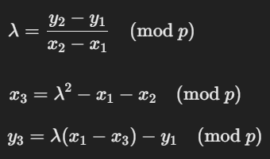
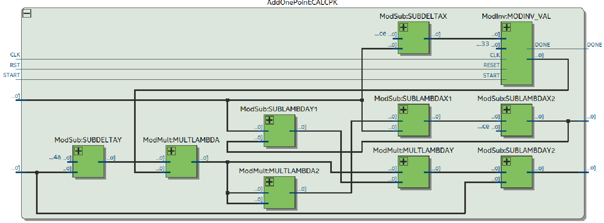

# EllipticCurveVHDL

Iteração sobre a Curva Elíptica

Este trabalho tem como objetivo realizar uma iteração sobre a chave privada de uma Curva Elíptica de 64 bits e
realizar a derivação para a chave pública correspondente. O objetivo anterior seria para fazer sobre uma Curva
Elíptica de 256 bits, conhecida como secp256k1 e utilizada no Bitcoin, porém o trabalho ficaria muito mais complexo,
porque para realizar a operação de Multiplicação é gerado um circuito muito grande em área e no caso da Divisão a
ferramenta não permite, limitando à 64 bits. Uma forma para contornar seria a utilização de Multiplicadores e Divisores
multi ciclos, mas teria que ser, de alguma forma, otimizado, porque não poderia ser realizado em 256 ciclos de clock.
Com isso, a redução de bits seria melhor para ser feito inicialmente, sendo possível passar para 256 bits facilmente
após todos cálculos testados, já que as fórmulas são iguais, o que muda é o número Primo e as suas coordenadas válidas iniciais.

A iteração sobre a chave privada ocorre com o valor inicial em 2 e a chave pública correspondente, passando a chave pública para
um componente que realiza a soma de dois pontos, sendo o outro ponto a chave pública da chave privada 1. Podemos exemplificar com
a função Puk, que representa a transformação da chave privada para a chave pública. Inicialmente temos Puk(2) e queremos realizar
uma incrementação da chave privada, para isso temos que fazer Puk(2) + Puk(1), que resultaria em uma chave privada 3 e sua chave
pública correspondente, Puk(3). Iniciamos na chave privada em 2, porque existem dois tipos de cálculo entre pontos em uma Curva Elíptica,
a Soma de Pontos e a Duplicação de Pontos. Esse trabalho implementa somente a soma de pontos, por isso começamos com o valor em 2.
Podemos ver a fórmula na imagem abaixo:

 
Imagem 1: Fórmulas usadas na Soma de Pontos na Curva Elíptica.

Não é possível realizar uma divisão sobre uma Curva Elíptica, com isso é utilizado a Inversão Modular do valor de deltaX, x2 - x1,
para então realizar a multiplicação e teremos o mesmo resultado de uma divisão. A Inversão Modular é feita pelo Algoritmo de Euclides Estendido e
os Coeficientes de Bézout. A função do mod p é para os resultados dos cálculos ficarem dentro do campo finito da Curva Elíptica, definido pelo Primo P.

A ferramenta utilizada foi o Quartus Prime Version 24.1 Lite e o Questa Intel Starter 2024.3, utilizando o device Cyclone IV GX e o Windows 10.
Não foi possível utilizar a versão 13 do Quartus porque ao realizar a Análise, o mesmo apresentava uma janela de erro e gerava erro na compilação
sem nenhum tipo de mensagem. Podemos ver nas imagens abaixo o circuito gerado e os valores:

Fmax = 3.38 MHz 
Total Logic Elements = 17.045 / 29.440 (58%) 
Total Registers = 554 
Total Pins = 76 / 167 (46%)

Imagem 2: Estrutura da função de Soma de Pontos..

Podemos ver pelas estatísticas geradas que a frequência máxima gerada é bastante baixa, o que indica que existe um caminho crítico grande, e
um uso grande de Elementos Lógicos. O uso de multiplicadores e divisores de ciclo único deve ter um peso grande nisso, apesar de facilitar o
uso dessas operações o custo é bastante alto na área e na frequência. O uso de Multiplicadores e Divisores multi ciclos deveriam ter sido
implementados para melhorar esses dados e para ser possível a implementação de Curva Elíptica de tamanho maiores.

Para realizar os testes e verificar a lista das chaves públicas comprimidas, criamos um testbench e utilizamos a ferramenta Questa.
Abaixo podemos ver os resultados:

PrivateKey: 2 PublicKey: 03C9FB2291BCAD1EF9 
PrivateKey: 3 PublicKey: 038A474886F6D38BF5 
PrivateKey: 4 PublicKey: 030B600C5BCE7CF70F 
PrivateKey: 5 PublicKey: 02866FF2EF9F6E1C7B 
PrivateKey: 6 PublicKey: 02805BCA318303D321 
PrivateKey: 7 PublicKey: 026EA24D99A018B106 
PrivateKey: 8 PublicKey: 0206FC782F35C80479 
PrivateKey: 9 PublicKey: 02DF89C00D060C9824 
PrivateKey: 10 PublicKey: 020419ED23FE05FA1D

